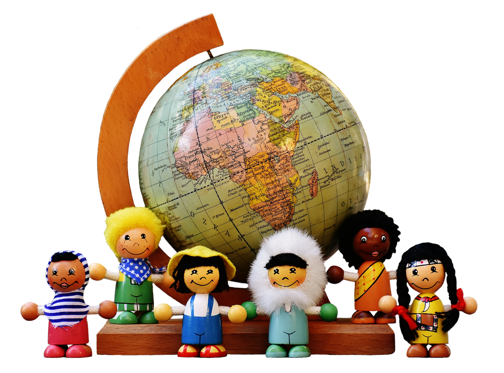

> Styles: [English](README.md), [Odia](Odia.md), [Translated](Translated.md). 
> [Click here to listen](https://soundcloud.com/teachersnigdha/breaking-selfish-love).

#### ଭାଇ ବନ୍ଧୁ, ଯେତେ ହୋଇଥିଲେ ଭିନ୍ନେ,
#### ଆଜ ହେଲେ ଏକ ଯୁଟ,
#### କେତେ କାଳୁ ଦୂର, ହୋଇ ରହିଥିଲେ,
#### ଏବେ ହୁଅନ୍ତି ଭେଟ ଘାଟ।
***
 

#### ଏକ ମନ, ଏକ ଆତ୍ମା ହୁଏ ଏକ,
#### ଏକ ସଙ୍ଗେ ହସ କାନ୍ଦ,
#### ଏକ ପରିବାର, ଏ ଧରା ମଣ୍ଡଳ,
#### ବାନ୍ଧିଲେ ସମ୍ପର୍କ ବନ୍ଧ।
***
 

#### ଆଜି ସାନ ବଡ଼, ସଭିଏଁ ସମାନ,
#### ଜାତି ଧର୍ମ ଲୋଡା ନହିଁ,
#### ମାନବର ଧର୍ମ, ପ୍ରତିଷ୍ଠା ହେଉଛି,
#### କର୍ମ ମହା ଧର୍ମ ହୋଇ।
***
 

#### ଧନୀ ଗରୀବର, ସେ ମହା ପ୍ରାଚୀର,
#### ପଡି ଯାଇଅଛି ସୋଇ,
#### ପ୍ରାଚୀର କୁ ଟେକି, ଉଠାଇବା ପାଇଁ,
#### କିଏ ନହିଁ କେଓଁଥାଇଁ।
***
 

#### ଡାକ୍ତର ଝାଡ଼ୁଦାର, ଅବା ସରକାର,
#### ଦେଶର ଅଟନ୍ତି ପୂଜ୍ୟ,
#### ସଜାଗ ପ୍ରହରୀ, ଅଟନ୍ତି ମହାନ,
#### ମହାନ କୃଷି ସମାଜ।
***
 

#### ବିଶ୍ଵ ଦରବାରରେ, ଆମ୍ଭେ ଯେତେ ପ୍ରାଣୀ,
#### କରିବା ସଭିଙ୍କୁ ସ୍ନେହ,
#### ମମତାର ମୂଲ, ତୁଳନା ନୁହଇଁ,
#### ଟୁଟାଇ ସ୍ୱାର୍ଥର ମୋହ।
***
 

- Poem by ସ୍ନିଗ୍ଧା ରାଣୀ ସାହୁ
- Image by Alexas_Fotos from Pixabay
